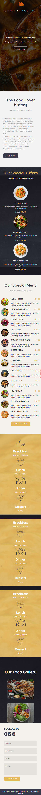

# 🍽️ Food Lover Restaurant Website

A responsive restaurant website template built by following Mohamed Elkashef’s walkthrough tutorial.  
This project is called **Food Lover**, and it demonstrates the use of **HTML & CSS** to create a modern, mobile-friendly restaurant landing page.

---

## 🚀 Features
- Responsive design for desktop and mobile devices  
- Modern layout with **Flexbox**  
- Semantic and clean HTML structure  
- Custom styling with CSS  
- Sections for menu, about, contact, and hero banner  

---

## 📂 Project Structure
food-lover-restaurant-website/
├── index.html
├── style.css
├── images/
└── README.md

---

## 🖼️ Preview
### Desktop Version  

### Mobile Version  

---

## 🌐 Live Demo
Check out the live version of this project here:  
👉 [Food Lover Live Demo](https://Nabil-Hany22.github.io/food-lover-restaurant-website/)

---

## 🛠️ Built With
- HTML5  
- CSS3 (Flexbox, Media Queries)  

---

## 🙌 Acknowledgments
- Inspired by [Mohamed Elkashef’s Food Lover tutorial](https://www.youtube.com/watch?v=hE0azYXN_W0&t=15s&ab_channel=MohamedElkashef).  
